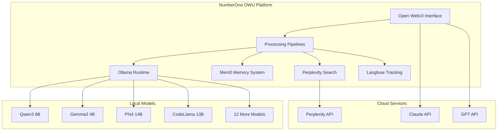

# 🤖 NumberOne OWU - AI Agents & Models Documentation

## Overview

NumberOne OWU implements a sophisticated multi-agent AI architecture that combines local models with cloud services for optimal performance, privacy, and capability. This document outlines the agent system, model configurations, and integration patterns.

## 🏗️ Agent Architecture

### Core Components



## 🧠 Local AI Models

### Flagship Models (Latest 2025)

#### **Qwen3 8B** - Next-Generation Reasoning
- **Size**: 5.2 GB
- **Strengths**: Advanced reasoning, MoE architecture, multilingual
- **Use Cases**: Complex problem solving, research, analysis
- **Context**: 128K tokens
- **Languages**: 29+ languages including English, Chinese, Japanese

#### **Gemma3 4B** - Google's Efficient Model
- **Size**: 3.3 GB  
- **Strengths**: Efficient inference, strong coding, safety-focused
- **Use Cases**: Code generation, safe AI interactions, mobile deployment
- **Context**: 8K tokens
- **Specialty**: Optimized for single-GPU deployment

#### **Phi4 14B** - Microsoft's Latest
- **Size**: 9.1 GB
- **Strengths**: Mathematical reasoning, scientific tasks, efficiency
- **Use Cases**: STEM education, research, technical writing
- **Context**: 16K tokens
- **Specialty**: Advanced mathematical and scientific reasoning

### Specialized Models

#### **CodeLlama 13B** - Code Specialist
- **Size**: 7.3 GB
- **Strengths**: Code generation, debugging, explanation
- **Use Cases**: Programming assistance, code review, documentation
- **Languages**: Python, JavaScript, C++, Java, and 20+ more
- **Context**: 16K tokens

#### **Qwen2.5 7B** - Balanced Performance
- **Size**: 4.4 GB
- **Strengths**: General purpose, fast inference, reliable
- **Use Cases**: Daily tasks, conversation, content creation
- **Context**: 32K tokens
- **Specialty**: Excellent balance of speed and capability

### Additional Models (11 more)
- **Qwen2.5 14B** - Larger variant for complex tasks
- **Mistral 7B Instruct** - European AI excellence
- **DeepSeek Coder 6.7B** - Advanced code understanding
- **Llama3.2 3B** - Ultra-fast responses
- **Nomic Embed Text** - Embedding generation
- **And 6 more specialized models**

## 🔧 Pipeline System

### Memory Pipeline (Mem0)

**Purpose**: Persistent cross-conversation memory

**Features**:
- **Automatic Storage**: Stores memories every 3 user messages
- **Semantic Search**: Vector-based memory retrieval
- **User Isolation**: Separate memory spaces per user
- **Context Integration**: Seamlessly adds relevant memories to conversations

**Configuration**:
```python
# Memory settings
store_cycles: 3  # Messages before storage
mem_zero_user: "bailey"  # User identifier
vector_store: "qdrant"  # Vector database
embedding_model: "nomic-embed-text:latest"
```

**Use Cases**:
- Remember user preferences and context
- Maintain conversation continuity
- Build long-term user relationships
- Personalized AI interactions

### Search Pipeline (Perplexity)

**Purpose**: Real-time web information retrieval

**Features**:
- **Smart Triggers**: AI decides when search is needed
- **Manual Control**: Use "search:" prefix for explicit searches
- **Source Citations**: Transparent information sourcing
- **Domain Filtering**: Target specific websites or exclude domains

**Configuration**:
```python
# Search settings
search_model: "llama-3.1-sonar-large-128k-online"
enable_auto_search: true
search_trigger_keywords: ["latest", "current", "news", "today"]
max_search_results: 5
```

**Use Cases**:
- Current events and news
- Real-time information lookup
- Fact-checking and verification
- Research and analysis

### Tracking Pipeline (Langfuse)

**Purpose**: LLM observability and analytics

**Features**:
- **Token Usage**: Track input/output tokens across models
- **Performance Metrics**: Response times and throughput
- **Cost Analysis**: Estimate usage costs
- **User Analytics**: Interaction patterns and preferences

**Configuration**:
```python
# Tracking settings
enable_tracking: true
enable_cost_tracking: true
track_response_time: true
anonymize_user_data: false
```

**Use Cases**:
- Monitor system performance
- Optimize model selection
- Track usage patterns
- Cost management

## 🎯 Agent Selection Strategy

### Automatic Model Selection

The system intelligently routes queries based on:

1. **Content Analysis**: Keywords, complexity, domain
2. **Performance Requirements**: Speed vs. quality trade-offs
3. **Resource Availability**: Model availability and load
4. **User Preferences**: Historical usage patterns

### Manual Model Selection

Users can explicitly choose models for specific needs:

- **Qwen3 8B**: Complex reasoning and analysis
- **Gemma3 4B**: Fast, efficient responses
- **Phi4 14B**: Mathematical and scientific tasks
- **CodeLlama 13B**: Programming and development
- **Qwen2.5 7B**: General-purpose conversations

## 🔄 Agent Lifecycle

### Initialization
1. **Model Loading**: Ollama loads selected models into memory
2. **Pipeline Setup**: Initialize memory, search, and tracking
3. **Health Checks**: Verify all components are responsive
4. **Configuration**: Apply user-specific settings

### Runtime Management
1. **Request Routing**: Direct queries to appropriate models
2. **Pipeline Processing**: Apply memory, search, and tracking
3. **Response Generation**: Generate and post-process responses
4. **Context Management**: Maintain conversation state

### Performance Optimization
1. **Model Caching**: Keep frequently used models in memory
2. **Pipeline Efficiency**: Optimize processing order
3. **Resource Balancing**: Distribute load across available resources
4. **Adaptive Selection**: Learn from usage patterns

## 🛠️ Configuration Management

### Environment Variables
```bash
# Model Configuration
OLLAMA_KEEP_ALIVE=5m
MEM0_STORE_CYCLES=3
PERPLEXITY_API_KEY=your_key

# Performance Tuning
OLLAMA_MAX_MEMORY=8
PIPELINE_WORKERS=4
CACHE_SIZE=1000
```

### Pipeline Valves
Each pipeline exposes configurable "valves" through the Open WebUI interface:

- **Memory Valves**: Storage frequency, retrieval settings
- **Search Valves**: Trigger keywords, domain filters
- **Tracking Valves**: Metrics collection, privacy settings

### Model Parameters
Fine-tune model behavior:
```python
{
    "temperature": 0.7,      # Creativity level
    "top_p": 0.9,           # Nucleus sampling
    "max_tokens": 2000,     # Response length
    "frequency_penalty": 0,  # Repetition control
    "presence_penalty": 0    # Topic diversity
}
```

## 📊 Performance Metrics

### Response Time Targets
- **Fast Models** (Llama3.2 3B): < 2 seconds
- **Balanced Models** (Qwen2.5 7B): < 5 seconds
- **Large Models** (Phi4 14B): < 10 seconds
- **Search Queries**: < 15 seconds

### Quality Metrics
- **Accuracy**: Task completion rate
- **Relevance**: Response appropriateness
- **Consistency**: Behavior predictability
- **User Satisfaction**: Feedback scores

### Resource Usage
- **Memory**: Model size + context buffer
- **CPU**: Inference computation
- **GPU**: Accelerated processing (optional)
- **Network**: API calls and data transfer

## 🔒 Privacy & Security

### Data Handling
- **Local Processing**: Most models run entirely offline
- **Memory Isolation**: User-specific memory spaces
- **Encryption**: Optional conversation encryption
- **No Telemetry**: No usage data sent to external services

### Access Control
- **User Authentication**: Secure login system
- **Role-Based Access**: Admin, user, and guest roles
- **API Security**: Encrypted communication
- **Audit Logging**: Track system access and usage

## 🚀 Advanced Features

### Multi-Modal Capabilities
- **Text Processing**: All models support text input/output
- **Code Understanding**: Specialized models for programming
- **Mathematical Reasoning**: Advanced STEM capabilities
- **Multilingual Support**: 29+ languages across models

### Integration Patterns
- **API Compatibility**: OpenAI-compatible endpoints
- **Webhook Support**: Real-time event notifications
- **Plugin Architecture**: Extensible pipeline system
- **Custom Models**: Support for user-provided models

### Experimental Features
- **Model Ensembles**: Combine multiple models for better results
- **Dynamic Routing**: AI-powered model selection
- **Federated Learning**: Collaborative model improvement
- **Edge Deployment**: Lightweight model variants

## 📚 Best Practices

### Model Selection
1. **Start Simple**: Use Qwen2.5 7B for general tasks
2. **Specialize**: Switch to CodeLlama for programming
3. **Scale Up**: Use Phi4 14B for complex reasoning
4. **Optimize**: Monitor performance and adjust

### Memory Management
1. **Regular Cleanup**: Periodically review stored memories
2. **User Isolation**: Maintain separate memory spaces
3. **Relevance Tuning**: Adjust retrieval thresholds
4. **Privacy Awareness**: Consider memory content sensitivity

### Search Integration
1. **Smart Triggers**: Let AI decide when to search
2. **Query Optimization**: Use clear, specific search terms
3. **Source Verification**: Always check citations
4. **Rate Limiting**: Respect API usage limits

### Performance Tuning
1. **Resource Monitoring**: Track CPU, memory, and GPU usage
2. **Model Rotation**: Keep active models in memory
3. **Pipeline Optimization**: Minimize processing overhead
4. **User Feedback**: Continuously improve based on usage

This agent system provides NumberOne OWU with intelligent, context-aware AI assistance that adapts to user needs while maintaining high performance and privacy standards.
